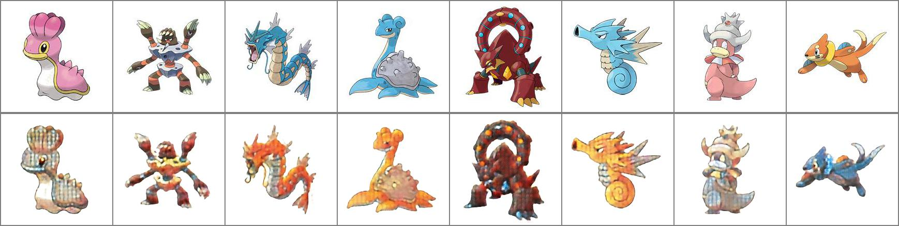
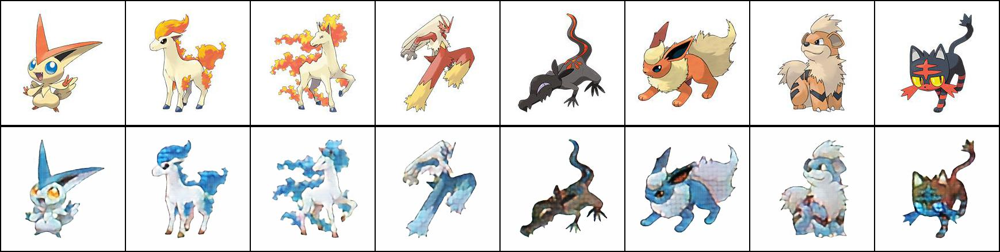
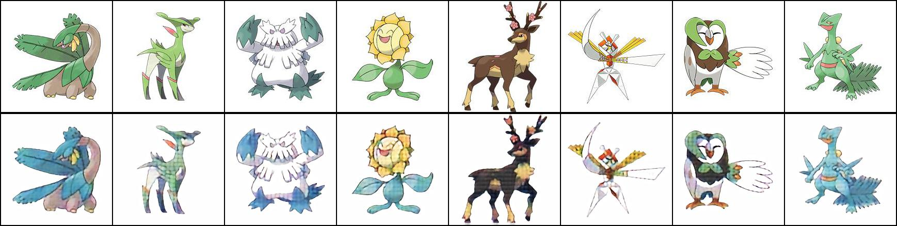
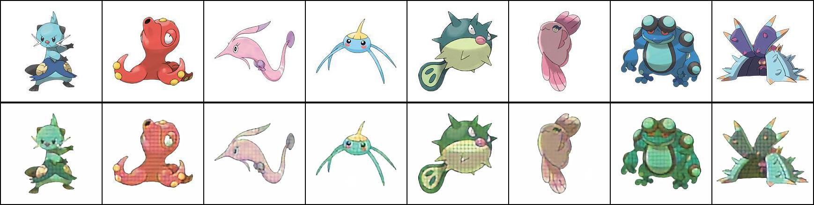
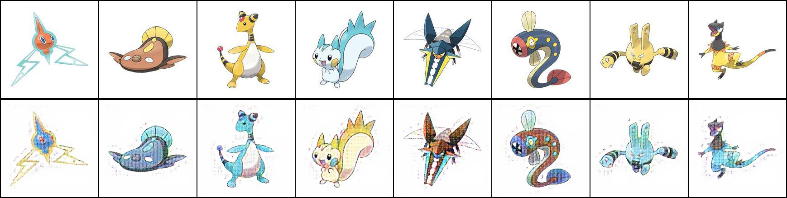
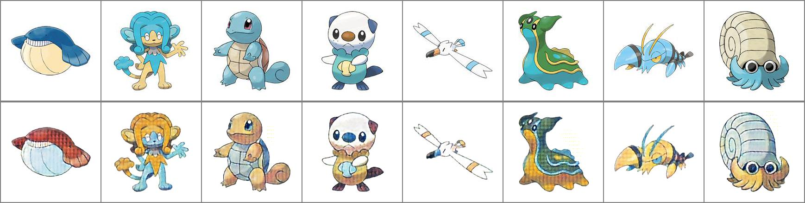
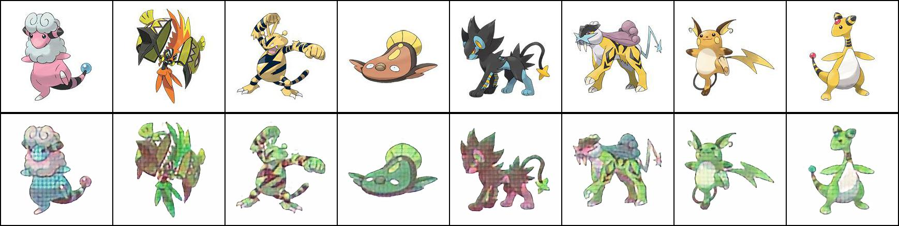
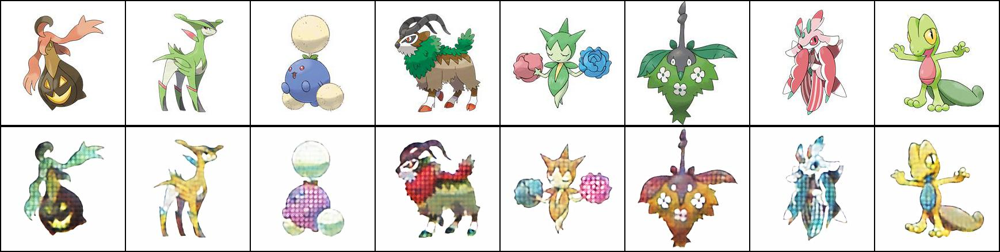

# CycleGAN to Swap Pokemon Types
An implementation of CycleGAN in order to swap Pokemon types.

Original paper: https://arxiv.org/abs/1703.10593

<b> Potential Improvements to Investigate </b>
* Add new different pictures of same pokemon to increase training set
* Implement distill's conv-resample to attempt to remove checkerboard pattern
* Implementation of InstaGAN in order to change geometric shape

<b> Observations During Training </b>
* Sometimes identical mapping will be learned after a lot of training
* Some colors are mapped indescriminantly (often blue and red in between fire and water)
* Change in learning rate can cause large changes at times

### Display of Results ###
#### Water to Fire ####

#### Fire to Water ####

#### Grass to Water ####

#### Water to Grass ####

#### Electric to Water ####

#### Water to Electric ####

#### Electric to Grass ####

#### Grass to Electric ####

